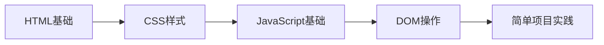

# 前端开发学习中心

欢迎来到前端开发学习中心！这里汇集了前端开发的核心技术栈，从基础的HTML/CSS到现代的JavaScript，再到浏览器原理，帮助你构建完整的前端知识体系。

## 🎯 学习模块

### 🏗️ [HTML/CSS 基础](./html-css/)
掌握网页结构和样式的基础技术
- **HTML语义化** - 构建结构清晰的网页
- **CSS样式** - 创建美观的用户界面
- **响应式布局** - 适配各种设备屏幕
- **动画效果** - 提升用户交互体验

### ⚡ [JavaScript 核心](./javascript/)  
深入学习JavaScript编程语言
- **语法基础** - 变量、函数、对象等核心概念
- **异步编程** - Promise、async/await处理
- **面向对象** - 类、继承、设计模式
- **现代特性** - ES6+新语法和特性

### 🌐 [浏览器原理](./browser/)
理解浏览器的工作机制
- **事件循环** - JavaScript执行机制
- **渲染原理** - 页面渲染过程
- **性能优化** - 提升网页加载速度
- **调试技巧** - 开发者工具使用

## 🚀 学习路径推荐

### 🎯 初学者路径（0-6个月）

**第1-2个月：HTML/CSS基础**
- 学习HTML标签和语义化
- 掌握CSS选择器和样式属性
- 理解盒模型和定位原理
- 完成静态页面练习

**第3-4个月：JavaScript入门**
- 掌握JavaScript基础语法
- 学习函数和对象概念
- 理解DOM操作和事件处理
- 完成交互式页面

**第5-6个月：综合实践**
- 结合HTML/CSS/JS开发项目
- 学习调试和问题解决
- 了解代码规范和最佳实践

### 🔥 进阶路径（6-12个月）

**第7-8个月：现代JavaScript**
- 深入学习ES6+新特性
- 掌握异步编程模式
- 理解模块化和包管理
- 学习函数式编程思想

**第9-10个月：工程化开发**
- 学习Webpack/Vite等构建工具
- 掌握代码分割和优化
- 了解单元测试和自动化
- 学习Git版本控制

**第11-12个月：框架应用**
- 选择一个主流框架深入学习
- 理解组件化开发思想
- 掌握状态管理方案
- 完成完整的SPA项目

### 🏆 高级路径（12个月+）

**性能优化专家**
- 深入理解浏览器渲染原理
- 掌握各种性能优化技巧
- 学习监控和分析工具
- 能够解决复杂性能问题

**架构设计能力**
- 设计可维护的前端架构
- 制定团队开发规范
- 选择合适的技术栈
- 解决大型项目的技术难题

## 💡 核心技能树

### 基础技能 (必须掌握)
- ✅ HTML语义化标签
- ✅ CSS布局技术 (Flexbox/Grid)
- ✅ JavaScript ES6+语法
- ✅ DOM操作和事件处理
- ✅ 异步编程 (Promise/async-await)
- ✅ 浏览器开发者工具

### 进阶技能 (重要)
- 🔄 模块化开发 (ES Modules)
- 🔄 构建工具 (Webpack/Vite)
- 🔄 版本控制 (Git)
- 🔄 包管理 (npm/yarn)
- 🔄 代码规范 (ESLint/Prettier)
- 🔄 单元测试 (Jest/Vitest)

### 高级技能 (加分项)
- ⭐ 前端框架 (React/Vue/Angular)
- ⭐ 状态管理 (Redux/Vuex/Pinia)
- ⭐ TypeScript
- ⭐ 服务端渲染 (SSR/SSG)
- ⭐ 微前端架构
- ⭐ 性能监控和优化

## 🛠️ 开发工具链

### 编辑器
- **VS Code** - 最受欢迎的前端编辑器
- **WebStorm** - 功能强大的IDE
- **Sublime Text** - 轻量级编辑器

### 浏览器
- **Chrome DevTools** - 最强大的调试工具
- **Firefox Developer Edition** - 专为开发者设计
- **Safari Web Inspector** - Mac平台优选

### 构建工具
- **Vite** - 现代化的构建工具
- **Webpack** - 成熟的模块打包器
- **Parcel** - 零配置构建工具

### 版本控制
- **Git** - 分布式版本控制
- **GitHub** - 代码托管平台
- **GitLab** - 企业级Git平台

## 📚 学习资源

### 官方文档
- [MDN Web Docs](https://developer.mozilla.org/zh-CN/) - 权威的Web技术文档
- [W3C标准](https://www.w3.org/) - Web标准制定组织
- [ECMAScript规范](https://tc39.es/ecma262/) - JavaScript语言规范

### 在线学习
- [freeCodeCamp](https://www.freecodecamp.org/) - 免费编程课程
- [JavaScript.info](https://javascript.info/) - 现代JavaScript教程
- [CSS-Tricks](https://css-tricks.com/) - CSS技巧和教程

### 实践平台
- [CodePen](https://codepen.io/) - 在线代码演示
- [JSFiddle](https://jsfiddle.net/) - JavaScript在线调试
- [LeetCode](https://leetcode-cn.com/) - 算法练习平台

## 🎨 项目实践

### 基础项目
- 📝 个人简历网站
- 🎮 简单的小游戏
- 📊 数据可视化图表
- 🛒 购物车功能

### 进阶项目
- 📱 响应式Web应用
- 🎵 音乐播放器
- 📰 新闻聚合网站
- 💬 实时聊天应用

### 高级项目
- 🏢 企业级管理后台
- 🎯 性能监控平台
- 🔧 开发者工具
- 📦 组件库/框架

## 🤝 社区参与

### 技术社区
- **掘金** - 中文技术分享平台
- **思否** - 问答和分享社区
- **GitHub** - 开源项目参与

### 会议活动
- **Vue Conf** - Vue.js技术大会
- **React Conf** - React技术大会
- **JSConf** - JavaScript技术大会

### 学习小组
- 加入本地前端学习小组
- 参与开源项目贡献
- 建立技术分享习惯

前端技术日新月异，保持学习的热情和好奇心是成长的关键。选择适合自己的学习路径，循序渐进地提升技能，相信你一定能成为优秀的前端开发者！🚀 